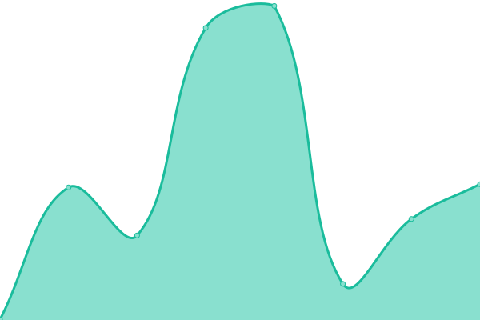
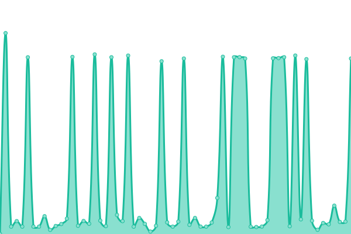
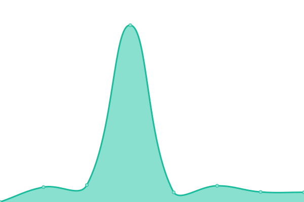
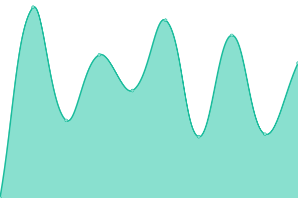
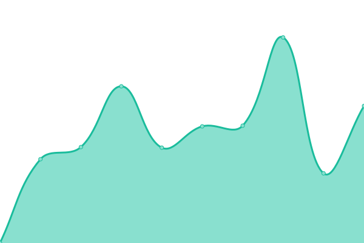

# [📈 Live Status](https://sumito74.github.io/upptime): <!--live status--> **🟧 Partial outage**

This repository contains the open-source uptime monitor and status page for [Diego Daniel Rende](www.diegorende.com.ar), powered by [Upptime](https://github.com/upptime/upptime).

With [Upptime](https://upptime.js.org), you can get your own unlimited and free uptime monitor and status page, powered entirely by a GitHub repository. We use [Issues](https://github.com/sumito74/upptime/issues) as incident reports, [Actions](https://github.com/sumito74/upptime/actions) as uptime monitors, and [Pages](https://sumito74.github.io/upptime) for the status page.

<!--start: status pages-->
<!-- This summary is generated by Upptime (https://github.com/upptime/upptime) -->
<!-- Do not edit this manually, your changes will be overwritten -->
<!-- prettier-ignore -->
| URL | Status | History | Response Time | Uptime |
| --- | ------ | ------- | ------------- | ------ |
|  [MALS OSPACA](https://mail.ospaca.com) | 🟩 Up | [mals-ospaca.yml](https://github.com/sumito74/upptime/commits/HEAD/history/mals-ospaca.yml) | 

 855ms
     
 | 

<a href="https://sumito74.github.io/upptime/history/mals-ospaca">100.00%</a>
    

|  [SISTEMAS OSPACA](https://sistema.ospaca.com/intranet) | 🟩 Up | [sistemas-ospaca.yml](https://github.com/sumito74/upptime/commits/HEAD/history/sistemas-ospaca.yml) | 

 1374ms
     
 | 

<a href="https://sumito74.github.io/upptime/history/sistemas-ospaca">100.00%</a>
    

|  [QR ROYAL-HOLIDAY](https://cupones.royalholiday.com.ar/admin/) | 🟩 Up | [qr-royal-holiday.yml](https://github.com/sumito74/upptime/commits/HEAD/history/qr-royal-holiday.yml) | 

 343ms
     
 | 

<a href="https://sumito74.github.io/upptime/history/qr-royal-holiday">100.00%</a>
    

|  [SISTEMA ROYAL-HOLIDAY](https://www.royalholiday.com.ar/reservas/admin/) | 🟥 Down | [sistema-royal-holiday.yml](https://github.com/sumito74/upptime/commits/HEAD/history/sistema-royal-holiday.yml) | 

 1882ms
     
 | 

<a href="https://sumito74.github.io/upptime/history/sistema-royal-holiday">87.91%</a>
    

|  [SISTEMA ROYAL-HOLIDAY CHILE](https://chile.royalholiday.com.ar:1443/reservas/admin/) | 🟩 Up | [sistema-royal-holiday-chile.yml](https://github.com/sumito74/upptime/commits/HEAD/history/sistema-royal-holiday-chile.yml) | 

 1079ms
     
 | 

<a href="https://sumito74.github.io/upptime/history/sistema-royal-holiday-chile">100.00%</a>
    

|  [MAIL HOME](https://mail.diegorende.com.ar) | 🟥 Down | [mail-home.yml](https://github.com/sumito74/upptime/commits/HEAD/history/mail-home.yml) | 

 1256ms
     
 | 

<a href="https://sumito74.github.io/upptime/history/mail-home">82.51%</a>
    

|  [CLOUD HOME](https://nextcloud.diegorende.com.ar) | 🟥 Down | [cloud-home.yml](https://github.com/sumito74/upptime/commits/HEAD/history/cloud-home.yml) | 

 1232ms
     
 | 

<a href="https://sumito74.github.io/upptime/history/cloud-home">82.51%</a>
    

<!--end: status pages-->

[**Visit our status website →**](https://sumito74.github.io/upptime)

## 📄 License

- Powered by: [Upptime](https://github.com/upptime/upptime)
- Code: [MIT](./LICENSE) © [Diego Daniel Rende](www.diegorende.com.ar)
- Data in the `./history` directory: [Open Database License](https://opendatacommons.org/licenses/odbl/1-0/)
